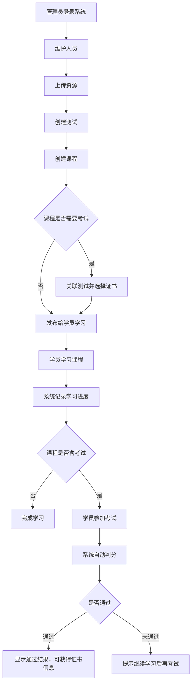
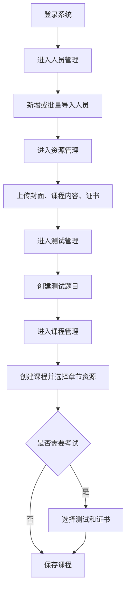
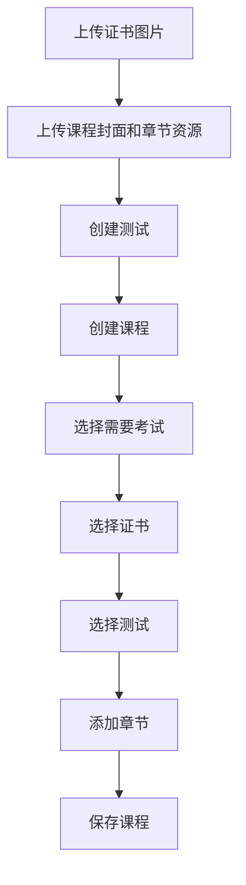
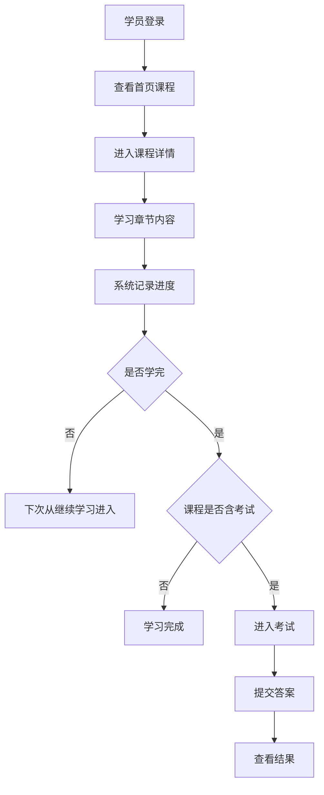
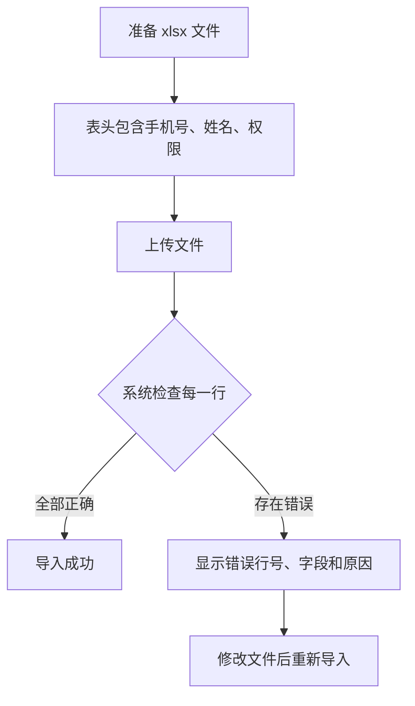

# 培训管理系统使用说明书

> 适用读者：行政人员、运营人员、培训负责人、项目管理人员、业务管理人员。

# 第一章 系统简介

## 1.1 系统主要用途

培训管理系统用于集中管理企业培训中的人员、学习资源、课程和测试。管理员可以维护企业人员信息、上传培训资料、创建课程章节、配置考试；

## 1.2 系统解决的问题

| 业务问题 | 系统处理方式 |
| --- | --- |
| 人员分散，难以统一维护 | 通过人员管理统一新增、查询、编辑和批量导入人员 |
| 培训资料散落在不同位置 | 通过资源管理统一上传图片、视频、PDF |
| 课程内容缺少结构 | 通过课程管理把资源整理成微课程或系列课程 |
| 培训后缺少测试验证 | 通过测试管理配置题目、分值、通过分数 |
| 学习进度难以追踪 | 学员学习时系统自动记录观看位置、完成状态和最近学习记录 |
| 考试结果难以统一判断 | 系统自动判分，达到通过分数后显示通过结果 |

## 1.3 哪些人员使用

| 人员类型 | 主要使用内容 |
| --- | --- |
| 管理员 | 人员管理、课程管理、资源管理、测试管理、个人中心 |
| 普通用户(仅限管理自己创建的) | 课程管理、资源管理、测试管理、个人中心 |
| 培训负责人 | 设计课程结构、上传课程资料、配置考试和证书 |
| 运营人员 | 查询课程、资源、测试，维护基础信息 |

## 1.4 系统主要功能

当前管理端可见菜单包括：

| 菜单     | 功能概述                                                     |
| -------- | ------------------------------------------------------------ |
| 人员管理 | 管理系统用户，支持新增、编辑、详情、删除、批量删除、批量导入 |
| 课程管理 | 创建微课程或系列课程，配置封面、章节、课程内容、考试和证书   |
| 资源管理 | 上传和维护图片、视频、PDF 等资源                             |
| 测试管理 | 创建测试，维护选择题、填空题、时长和通过分数                 |
| 个人中心 | 修改个人资料、头像和密码                                     |

## 1.5 系统整体业务流程

## 1.6 首页介绍

当前管理端登录后默认进入【课程管理】页面。页面左侧为功能菜单，底部显示当前登录人员姓名和退出入口。

---

# 第二章 登录与首页

## 2.1 登录页面

登录页面标题为【培训管理系统】，支持两种登录方式：

| 登录方式               | 需要填写             |
| ---------------------- | -------------------- |
| 密码登录               | 公司、手机号、密码   |
| 验证码登录（暂不支持） | 公司、手机号、验证码 |

## 2.2 用户如何登录

### 密码登录

1. 打开系统登录页。
2. 在【公司】下拉框选择所在公司。
3. 输入手机号。
4. 输入密码。
5. 点击【登录】。
6. 登录成功后进入系统默认页面。

### 验证码登录（暂不支持）

1. 切换到【验证码登录】。
2. 选择公司。
3. 输入手机号。
4. 点击【获取验证码】。
5. 输入收到的验证码。
6. 点击【登录】。

系统会在获取验证码后显示 60 秒倒计时，倒计时结束前不能重复获取。

## 2.3 忘记密码怎么办

当前页面没有“忘记密码”入口。可以联系管理员重置或协助处理。新增人员的初始密码由系统统一设置为 `123456`。

## 2.4 首次登录需要注意什么

| 注意事项         | 说明                                           |
| ---------------- | ---------------------------------------------- |
| 确认公司选择正确 | 公司选择错误时，系统会提示该公司下不存在此用户 |
| 使用手机号登录   | 手机号必须为 11 位中国大陆手机号格式           |
| 初始密码         | 管理员新增人员后，默认密码为 `123456`          |
| 建议修改密码     | 首次登录后建议进入【个人中心】修改密码         |

## 2.5 顶部和左侧菜单

| 区域       | 作用                                             |
| ---------- | ------------------------------------------------ |
| 左侧菜单   | 切换人员管理、课程管理、资源管理、测试管理等功能 |
| 左下角姓名 | 点击可进入个人中心                               |
| 退出图标   | 点击后弹出确认框，确认后退出登录                 |

## 2.6 退出登录

1. 在左侧菜单底部点击退出图标。
2. 系统弹出【确定退出登录？】。
3. 点击【确定】后返回登录页。

---

# 第三章 功能模块说明

## 3.1 人员管理

### 模块作用

人员管理用于维护可登录系统的人员信息，包括姓名、手机号、用户名和权限。

### 什么时候使用

| 场景                   | 是否使用本模块                 |
| ---------------------- | ------------------------------ |
| 新员工需要登录学习     | 使用【添加】新增人员           |
| 多名人员一次性导入     | 使用【批量添加】上传 xlsx 文件 |
| 修改手机号、姓名、权限 | 使用【编辑】                   |
| 查看人员资料           | 使用【详情】                   |
| 人员不再使用系统       | 使用【删除】或【批量删除】     |

### 页面组成

| 区域     | 说明                               |
| -------- | ---------------------------------- |
| 查询区   | 可按用户名、手机号、姓名、权限筛选 |
| 人员列表 | 展示用户名、手机号、姓名、权限     |
| 操作列   | 详情、编辑、删除                   |
| 添加按钮 | 新增单个人员                       |
| 批量删除 | 勾选人员后显示                     |

### 表格列说明

| 列名   | 含义                                                 |
| ------ | ---------------------------------------------------- |
| 用户名 | 登录账号名称；新增时可不填，由系统自动生成，必须唯一 |
| 手机号 | 登录手机号，必须唯一                                 |
| 姓名   | 人员真实姓名或业务显示名称                           |
| 权限   | 用户或管理员                                         |

### 如何新增人员

1. 进入【人员管理】。
2. 点击【添加】。
3. 填写手机号、姓名、权限。
4. 用户名可填写，也可留空。
5. 点击【确定】。
6. 保存成功后返回人员列表。

### 如何批量添加人员

1. 进入【人员管理】并点击【添加】。
2. 在添加用户页面点击【批量添加】。
3. 上传 xlsx 文件。
4. 文件表头必须包含：手机号、姓名、权限。
5. 权限只能填写 1 或 2，其中 1 表示普通用户，2 表示管理员。
6. 点击【确认导入】。

| 导入规则 | 说明                                   |
| -------- | -------------------------------------- |
| 文件格式 | 仅支持 `.xlsx`                         |
| 表头     | 必须包含手机号、姓名、权限             |
| 手机号   | 必填，且格式必须正确                   |
| 姓名     | 必填                                   |
| 权限     | 必填，只能为 1 或 2                    |
| 导入方式 | 任意一行有错误时，系统不会导入任何人员 |

### 系统自动处理内容

| 自动处理         | 说明                                         |
| ---------------- | -------------------------------------------- |
| 自动生成用户名   | 新增时不填用户名，系统生成 10 位字母数字组合 |
| 自动设置默认密码 | 新增人员默认密码为 `123456`                  |
| 自动记录所属公司 | 新增人员归属于当前登录人员所在公司           |
| 自动检查手机号   | 手机号已被使用时不能重复新增或修改           |
| 自动限制权限     | 只有管理员能进入人员管理菜单                 |

---

## 3.2 课程管理

### 模块作用

课程管理用于把培训资源整理成可学习的课程。课程支持两种类型：微课程和系列课程。

### 什么时候使用

| 场景                   | 操作                                         |
| ---------------------- | -------------------------------------------- |
| 创建单个短课程         | 选择【微课程】                               |
| 创建多个章节组成的课程 | 选择【系列课程】                             |
| 课程需要考试           | 选择“是否需要考试”为【是】，并选择证书和考试 |
| 课程不需要考试         | 选择“是否需要考试”为【否】                   |

### 页面组成

| 区域     | 说明                                            |
| -------- | ----------------------------------------------- |
| 查询区   | 按课程/系列名称、类型、管理员、是否需要考试查询 |
| 课程列表 | 展示课程名称、简介、类型、管理员、是否需要考试  |
| 操作列   | 详情、编辑、删除                                |
| 添加按钮 | 新增课程                                        |
| 批量删除 | 勾选课程后显示                                  |

### 课程详情表单

| 字段          | 说明                             |
| ------------- | -------------------------------- |
| 课程/系列名称 | 课程对外显示名称                 |
| 课程简介      | 课程内容介绍                     |
| 课程封面      | 只能选择或上传图片资源           |
| 类型          | 微课程或系列课程                 |
| 管理员        | 编辑已有课程时显示，不能手动修改 |
| 是否需要考试  | 决定是否必须选择考试和证书       |
| 证书          | 需要考试时必填，只能选择图片资源 |
| 考试          | 需要考试时必填，从测试列表中选择 |
| 章节列表      | 维护课程章节名称、描述和章节内容 |

### 如何新增课程

1. 进入【课程管理】。
2. 点击【添加】。
3. 填写课程名称和课程简介。
4. 选择课程封面。
5. 选择课程类型。
6. 选择是否需要考试。
7. 如需要考试，选择证书和考试。
8. 点击【添加章节】。
9. 填写章节名、章节描述，并选择章节内容。
10. 点击【确定】保存。

### 微课程与系列课程的区别

| 类型 | 规则 |
| --- | --- |
| 微课程 | 最多只有 1 个章节；切换为微课程时，如果已有多个章节，系统只保留第 1 个 |
| 系列课程 | 可以添加多个章节 |

### 系统自动处理内容

| 自动处理         | 说明                                               |
| ---------------- | -------------------------------------------------- |
| 自动记录创建人   | 课程创建人来自当前登录人员                         |
| 自动设置课程状态 | 新增课程默认不上线（后续会增加上线/下线按钮）      |
| 自动关联考试     | 课程选择考试后，系统建立课程与测试的对应关系       |
| 自动重建章节     | 编辑课程保存时，系统以当前页面章节为准重新生成章节 |
| 自动检查考试条件 | 需要考试时，证书和考试必须填写                     |

---

## 3.3 资源管理

### 模块作用

资源管理用于上传和维护课程中使用的图片、视频、PDF 文件。

### 什么时候使用

| 场景         | 操作          |
| ------------ | ------------- |
| 准备课程封面 | 上传图片资源  |
| 准备课程视频 | 上传视频资源  |
| 准备课程资料 | 上传 PDF 资源 |
| 准备证书图片 | 上传图片资源  |

### 页面组成

| 区域     | 说明                               |
| -------- | ---------------------------------- |
| 查询区   | 按资源名称、资源类型、作者查询     |
| 资源列表 | 展示资源名称、类型、资源内容、作者 |
| 操作列   | 详情、编辑、删除                   |
| 添加按钮 | 新增资源                           |
| 批量删除 | 勾选资源后显示                     |

### 资源类型

| 类型     | 支持格式       | 最大大小 |
| -------- | -------------- | -------- |
| 图片资源 | png、jpg、jpeg | 20MB     |
| 视频资源 | mp4、mov       | 100MB    |
| PDF 资源 | pdf            | 20MB     |

### 如何上传资源

1. 进入【资源管理】。
2. 点击【添加】。
3. 填写资源名称。
4. 选择资源类型。
5. 点击或拖拽文件到上传区域。
6. 上传成功后页面会显示预览或文件地址。
7. 点击【确定】保存。

### 系统自动处理内容

| 自动处理           | 说明                                       |
| ------------------ | ------------------------------------------ |
| 自动上传文件       | 选择文件后系统自动上传并生成可访问地址     |
| 自动记录作者       | 作者为当前登录人员姓名                     |
| 自动限制格式和大小 | 不符合格式或大小时不能上传                 |
| 自动预览           | 图片显示预览图，视频可播放，PDF 可打开预览 |

---

## 3.4 测试管理

### 模块作用

测试管理用于创建课程考试或独立测试，系统支持选择题和填空题，并可设置考试时长、分值和通过分数。

### 什么时候使用

| 场景             | 操作                       |
| ---------------- | -------------------------- |
| 课程需要考试     | 先创建测试，再到课程中关联 |
| 需要检查学习效果 | 创建测试题目               |
| 需要设置及格线   | 填写通过分数               |

### 页面组成

| 区域     | 说明                          |
| -------- | ----------------------------- |
| 查询区   | 按测试名称、作者查询          |
| 测试列表 | 展示测试 ID、名称、描述、作者 |
| 操作列   | 详情、编辑、删除              |
| 添加按钮 | 新增测试                      |
| 批量删除 | 勾选测试后显示                |

### 测试详情表单

| 字段     | 说明                        |
| -------- | --------------------------- |
| 测试名称 | 测试标题                    |
| 标签     | 测试分类或展示标签          |
| 测试描述 | 测试说明                    |
| 测试时长 | 小时和分钟，必须大于 0 分钟 |
| 通过分数 | 达到该分数即视为通过        |
| 题目列表 | 添加选择题或填空题          |

### 如何新增测试

1. 进入【测试管理】。
2. 点击【添加】。
3. 填写测试名称、标签、测试描述。
4. 设置测试时长。
5. 填写通过分数。
6. 点击【添加选择题】或【添加填空题】。
7. 为每道题填写分值、题目和答案。
8. 点击【确定】保存。

### 选择题规则

| 项目     | 说明                           |
| -------- | ------------------------------ |
| 默认选项 | 新增选择题默认 4 个选项        |
| 最少选项 | 至少保留 2 个选项              |
| 正确答案 | 通过单选圆点标记某个选项为答案 |
| 分值     | 必须大于 0                     |

### 填空题规则

| 项目      | 说明                                    |
| --------- | --------------------------------------- |
| 填空标记  | 在题目标题中使用 `$` 表示一个空         |
| 空数计算  | 系统会根据 `$` 的数量自动生成答案输入框 |
| 无 `$` 时 | 系统至少保留 1 个答案输入框             |
| 示例      | `《$》是$的作者` 表示两个空             |

### 系统自动处理内容

| 自动处理           | 说明                               |
| ------------------ | ---------------------------------- |
| 自动计算总分       | 保存时按所有题目分值累加           |
| 自动检查通过分数   | 通过分数不能大于题目总分           |
| 自动检查题目完整性 | 题目、选项、答案、分值必须符合规则 |
| 自动记录作者       | 作者来自当前登录人员               |

---

## 3.5 个人中心

### 模块作用

个人中心用于维护当前登录人员的个人资料、头像和密码。

### 页面组成

| 区域     | 说明                 |
| -------- | -------------------- |
| 公司信息 | 展示当前人员所属公司 |
| 基本资料 | 用户名、手机号、姓名 |
| 头像区域 | 查看头像、更换头像   |
| 修改密码 | 修改当前账号密码     |

### 如何修改个人资料

1. 点击左侧菜单底部的姓名进入【个人中心】。
2. 修改用户名、手机号或姓名。
3. 点击【保存】。

### 如何更换头像

1. 点击【更换头像】。
2. 上传 png、jpg、jpeg 或 webp 图片。
3. 文件大小不能超过 5MB。
4. 上传后查看预览。
5. 点击弹窗确认按钮保存头像。

### 如何修改密码

1. 点击【修改密码】。
2. 输入原密码。
3. 输入新密码。
4. 再次输入新密码。
5. 点击确认。

新密码要求：长度不少于 6 位，并且在大写字母、小写字母、数字、特殊符号中至少包含三类。

---

# 第四章 数据填写说明

## 4.1 登录字段

| 字段 | 必填 | 要求 | 示例 |
| --- | --- | --- | --- |
| 公司 | 是 | 从下拉框选择 | 北京分公司 |
| 手机号 | 是 | 11 位手机号，需以 1 开头，第二位为 3-9 | 13812345678 |
| 密码 | 密码登录必填 | 输入当前账号密码 | Abc123! |
| 验证码 | 验证码登录必填 | 获取后填写 | 123456 |

## 4.2 人员字段

| 字段 | 必填 | 要求 | 示例 |
| --- | --- | --- | --- |
| 用户名 | 新增时可不填；编辑时必填 | 不填时系统自动生成 | zhangsan |
| 手机号 | 是 | 11 位手机号，且不能与已有人员重复 | 13900001111 |
| 姓名 | 是 | 填写真实姓名或业务显示名 | 张三 |
| 权限 | 是 | 用户或管理员 | 用户 |

## 4.3 资源字段

| 字段     | 必填 | 要求                   | 示例           |
| -------- | ---- | ---------------------- | -------------- |
| 资源名称 | 是   | 用于识别资源           | 新员工培训封面 |
| 资源类型 | 是   | 图片、视频、PDF 三选一 | 视频资源       |
| 资源内容 | 是   | 按所选类型上传文件     | training.mp4   |

## 4.4 课程字段

| 字段 | 必填 | 要求 | 示例 |
| --- | --- | --- | --- |
| 课程/系列名称 | 是 | 课程显示名称 | 新员工入职培训 |
| 课程简介 | 是 | 简要说明课程内容 | 介绍公司制度与安全规范 |
| 课程封面 | 否 | 只能选择图片资源 | 封面图 |
| 类型 | 是 | 微课程或系列课程 | 系列课程 |
| 是否需要考试 | 是 | 是或否 | 是 |
| 证书 | 需要考试时必填 | 只能选择图片资源 | 结业证书模板 |
| 考试 | 需要考试时必填 | 从已有测试中选择 | 入职培训考试 |
| 章节名 | 每个章节必填 | 章节标题 | 第一章 公司介绍 |
| 章节描述 | 每个章节必填 | 章节说明 | 介绍公司发展和文化 |
| 章节内容 | 每个章节必填 | 选择图片、视频或 PDF 资源 | 公司介绍视频 |

## 4.5 测试字段

| 字段       | 必填 | 要求                          | 示例                     |
| ---------- | ---- | ----------------------------- | ------------------------ |
| 测试名称   | 是   | 测试标题                      | 安全培训测试             |
| 标签       | 是   | 用于分类或展示                | 认证考试                 |
| 测试描述   | 是   | 测试说明                      | 完成课程后参加           |
| 测试时长   | 是   | 必须大于 0 分钟，分钟最大 59  | 0 小时 30 分钟           |
| 通过分数   | 是   | 不能大于题目总分              | 60                       |
| 题目标题   | 是   | 题干内容                      | 灭火器使用前应先做什么？ |
| 分值       | 是   | 必须大于 0 的整数             | 5                        |
| 选择题选项 | 是   | 每个选项都不能为空，至少 2 个 | 拔掉保险销               |
| 填空题答案 | 是   | 每个空都必须填写答案          | 李白                     |

---

# 第五章 系统操作规则

## 5.1 什么时候允许保存

| 场景       | 保存条件                                                  |
| ---------- | --------------------------------------------------------- |
| 人员       | 手机号、姓名、权限填写完整，手机号格式正确且未重复        |
| 资源       | 资源名称、类型、文件填写完整，文件格式和大小符合要求      |
| 课程       | 基本信息完整，每个章节都填写章节名、描述和内容            |
| 含考试课程 | 除课程信息外，还必须选择证书和考试                        |
| 测试       | 测试信息完整，至少 1 道题，时长大于 0，通过分数不超过总分 |
| 个人资料   | 用户名、手机号、姓名填写完整，手机号格式正确              |
| 密码       | 原密码正确，新密码两次一致且强度符合要求                  |

## 5.2 什么时候不能保存

系统会自动检查以下情况：

| 情况                       | 结果                     |
| -------------------------- | ------------------------ |
| 必填项未填写               | 不能保存，并提示对应字段 |
| 手机号格式不正确           | 不能保存                 |
| 手机号已被使用             | 不能保存                 |
| 上传文件格式不匹配         | 不能上传                 |
| 上传文件超过大小限制       | 不能上传                 |
| 测试没有题目               | 不能保存                 |
| 测试时长为 0               | 不能保存                 |
| 通过分数大于题目总分       | 不能保存                 |
| 需要考试但未选择证书或考试 | 不能保存                 |

## 5.3 什么时候允许修改

| 数据     | 修改规则                                                   |
| -------- | ---------------------------------------------------------- |
| 人员     | 管理员可修改人员资料；普通用户只能在个人中心修改自己的资料 |
| 资源     | 可修改资源名称、类型和文件内容                             |
| 课程     | 可修改课程基本信息、考试配置和章节列表                     |
| 测试     | 可修改测试信息和题目列表                                   |
| 个人资料 | 当前登录人员可修改自己的用户名、手机号、姓名和头像         |

## 5.4 什么时候不能修改

| 情况                   | 说明                           |
| ---------------------- | ------------------------------ |
| 查看详情模式           | 详情页字段为只读状态，不能编辑 |
| 无权限                 | 当前账号没有对应操作权限       |
| 数据不存在             | 打开的记录已被删除或不可访问   |
| 修改手机号为已有手机号 | 系统不允许重复手机号           |

## 5.5 什么时候允许删除

| 数据 | 删除方式                 |
| ---- | ------------------------ |
| 人员 | 单条删除或勾选后批量删除 |
| 资源 | 单条删除或勾选后批量删除 |
| 课程 | 单条删除或勾选后批量删除 |
| 测试 | 单条删除或勾选后批量删除 |

删除前系统会弹出确认框，需要点击【确定】。

## 5.6 删除后的影响

| 删除对象 | 影响                                                       |
| -------- | ---------------------------------------------------------- |
| 人员     | 人员不再出现在列表中，相关登录会失效或不可用               |
| 资源     | 资源不再出现在资源列表中；已关联课程可能无法正常展示该内容 |
| 课程     | 系统会同步删除课程下的章节记录                             |
| 测试     | 系统会同步删除测试下的题目                                 |

## 5.7 审核、提交、导入、导出规则

| 功能          | 当前系统情况                       |
| ------------- | ---------------------------------- |
| 提交审核      | 当前管理端未提供审核流程           |
| 审核通过/驳回 | 当前管理端未提供审核功能           |
| 导入          | 人员支持 xlsx 批量导入             |
| 导出          | 当前管理端未看到导出按钮或导出流程 |

---

# 第六章 数据之间的关系

## 6.1 公司与人员

| 关系 | 说明 |
| --- | --- |
| 一个公司可以有多名人员 | 人员登录时必须选择公司 |
| 人员属于某个公司 | 系统会按公司隔离数据 |
| 公司启用后才出现在登录公司列表 | 登录页只展示启用状态的公司 |
| 超级管理员可不属于具体公司 | 根据系统业务逻辑推测，超级管理员可跨公司查看 |

## 6.2 人员与权限

| 权限 | 可见范围 |
| --- | --- |
| 管理员 | 可进入人员管理，并查看本公司内更多数据 |
| 普通用户 | 不能进入人员管理；资源、课程、测试通常只查看自己创建或可学习的数据 |

## 6.3 资源与课程

| 资源用途     | 规则                        |
| ------------ | --------------------------- |
| 课程封面     | 只能使用图片资源            |
| 证书         | 只能使用图片资源            |
| 章节内容     | 可使用图片、视频或 PDF 资源 |
| 课程引用资源 | 课程保存时记录所选资源      |

## 6.4 课程与章节

| 关系                     | 说明                           |
| ------------------------ | ------------------------------ |
| 一个课程包含多个章节     | 系列课程可添加多个章节         |
| 微课程最多一个章节       | 切换为微课程时多余章节会被移除 |
| 每个章节必须选择内容资源 | 没有内容资源不能保存课程       |
| 编辑课程会重建章节       | 保存后以当前页面章节为准       |

## 6.5 课程与测试

| 关系                       | 说明                         |
| -------------------------- | ---------------------------- |
| 课程可以不考试             | “是否需要考试”选择否         |
| 课程可以关联一个测试       | 选择“需要考试”后必须选择测试 |
| 测试可先独立创建           | 创建课程时再选择关联         |
| 关联测试会影响学员学习流程 | 学员完成课程后可进入考试     |

## 6.6 测试与题目

| 关系                 | 说明                     |
| -------------------- | ------------------------ |
| 一个测试包含多道题   | 至少 1 道题才能保存      |
| 题目有分值           | 总分为题目分值相加       |
| 通过分数不能超过总分 | 系统自动检查             |
| 编辑测试会重建题目   | 保存后以当前题目列表为准 |

## 6.7 学习进度与课程

根据系统业务逻辑推测：

| 关系                         | 说明                         |
| ---------------------------- | ---------------------------- |
| 学员观看章节后生成学习进度   | 系统记录观看位置和小节总时长 |
| 播放超过 90% 视为完成        | 系统自动标记该小节已完成     |
| 再次学习从较大观看位置继续   | 系统不会把进度倒退           |
| 首页继续学习取最近未完成记录 | 便于学员续学                 |

## 6.8 考试结果与证书

根据系统业务逻辑推测：

| 关系                         | 说明                     |
| ---------------------------- | ------------------------ |
| 考试提交后系统自动判分       | 得分达到通过分数即通过   |
| 同一学员同一考试不能重复提交 | 系统会记录提交状态       |
| 通过且课程配置证书           | 结果页会显示证书相关提示 |
| 考试记录有有效期             | 学员端考试记录保存 7 天  |

---

# 第七章 使用流程

## 7.1 管理员首次配置流程

## 7.2 创建含考试课程流程

## 7.3 学员学习流程

根据系统业务逻辑推测：

## 7.4 人员批量导入流程

---

# 第八章 常见提示说明

| 提示信息 | 出现原因 | 处理办法 |
| --- | --- | --- |
| 获取登录配置失败 | 公司列表加载失败 | 刷新页面或联系管理员 |
| 请输入手机号 | 手机号未填写 | 填写手机号 |
| 请输入正确的手机号 | 手机号格式不正确 | 填写 11 位正确手机号 |
| 登录失败，请稍后重试 | 登录请求未成功 | 检查网络、公司、手机号和密码 |
| 用户不存在 | 账号不存在或不可访问 | 联系管理员确认账号 |
| 密码错误 | 输入密码不正确 | 重新输入或联系管理员 |
| 账号已被禁用 | 账号状态不可用 | 联系管理员处理 |
| 该公司下不存在此用户 | 公司选择错误或账号不属于该公司 | 选择正确公司 |
| 登录尝试过于频繁 | 5 分钟内尝试次数过多 | 等待后再试 |
| 验证码已发送 | 验证码发送成功 | 查看短信并填写 |
| 验证码已过期，请重新获取 | 验证码超过有效期 | 重新获取验证码 |
| 验证码错误 | 验证码填写不正确 | 重新核对验证码 |
| 上传成功 | 文件已上传 | 继续保存表单 |
| 上传失败 | 文件上传未成功 | 检查文件或稍后重试 |
| 仅支持上传图片资源格式 | 文件格式不符合当前类型 | 更换符合要求的文件 |
| 文件大小不能超过 20MB | 图片或 PDF 超出限制 | 压缩或更换文件 |
| 文件大小不能超过 100MB | 视频超出限制 | 压缩或更换视频 |
| 请至少添加一道题目 | 测试没有题目 | 添加题目 |
| 测试时长必须大于 0 分钟 | 时长为 0 | 设置有效时长 |
| 通过分数不能大于题目总分 | 及格线超过总分 | 调低通过分数或增加题目分值 |
| 选择题至少需要 2 个选项 | 删除选项后不足 2 个 | 保留至少 2 个选项 |
| 需要考试时请选择证书 | 含考试课程未选证书 | 选择证书图片 |
| 含考试的课程必须配置关联考试 | 含考试课程未选测试 | 选择测试 |
| 请上传 xlsx 文件 | 批量导入未选择文件或格式不对 | 上传 xlsx 文件 |
| 表头必须包含：手机号、姓名、权限 | 导入文件表头不完整 | 修改表头后重新上传 |
| 权限值错误（仅允许 1 或 2） | 导入权限列填写错误 | 填写 1 或 2 |
| 原密码错误 | 修改密码时原密码不正确 | 重新输入原密码 |
| 两次输入的新密码不一致 | 确认密码与新密码不同 | 重新输入 |
| 新密码复杂度不足 | 密码不符合强度要求 | 使用更复杂密码 |
| 您已提交过本次考试，不能重复提交 | 同一考试已提交 | 查看已有结果 |

---

# 第九章 常见问题

## 9.1 为什么保存不了？

常见原因：

| 原因                           | 解决办法               |
| ------------------------------ | ---------------------- |
| 必填项没填                     | 按红色提示补全字段     |
| 手机号格式不正确               | 使用正确 11 位手机号   |
| 选择了需要考试但没选证书或测试 | 补选证书和测试         |
| 测试没有题目                   | 至少添加一道题         |
| 通过分数超过总分               | 调整通过分数或题目分值 |

## 9.2 为什么按钮是灰色或不能编辑？

| 原因             | 解决办法                       |
| ---------------- | ------------------------------ |
| 当前处于详情页   | 返回列表点击【编辑】进入编辑页 |
| 当前账号没有权限 | 使用管理员账号或联系管理员     |
| 上传正在进行     | 等待上传完成                   |

## 9.3 为什么删除不了？

| 原因                 | 解决办法             |
| -------------------- | -------------------- |
| 没有确认删除         | 在确认框点击【确定】 |
| 没有选择批量删除对象 | 先勾选列表记录       |
| 没有权限             | 联系管理员           |
| 数据不存在或不可访问 | 刷新列表后再操作     |

## 9.4 为什么查询不到数据？

| 原因                             | 解决办法               |
| -------------------------------- | ---------------------- |
| 查询条件过多                     | 清空部分条件后重新查询 |
| 数据属于其他公司                 | 确认登录公司是否正确   |
| 普通用户只能看部分自己创建的数据 | 使用管理员账号查看     |
| 数据已删除                       | 删除后列表不再显示     |

## 9.5 为什么导入失败？

| 原因                 | 解决办法                             |
| -------------------- | ------------------------------------ |
| 文件不是 xlsx        | 另存为 xlsx 后上传                   |
| 表头不正确           | 表头改为手机号、姓名、权限           |
| 手机号为空或格式错误 | 补全并修正手机号                     |
| 权限不是 1 或 2      | 改为 1 或 2                          |
| 某一行错误           | 系统不会导入任何行，需全部修正后重传 |

## 9.6 为什么考试失败或不能提交？

| 原因             | 解决办法                 |
| ---------------- | ------------------------ |
| 考试不存在       | 确认课程是否正确关联测试 |
| 已经提交过       | 查看已有考试结果         |
| 题目没有配置完整 | 管理员检查测试题目       |
| 得分低于通过分数 | 继续学习后再考试         |

## 9.7 为什么没有权限？

| 原因               | 解决办法                 |
| ------------------ | ------------------------ |
| 当前账号是普通用户 | 联系管理员调整权限       |
| 操作其他公司的数据 | 切换正确公司或联系管理员 |
| 登录已过期         | 重新登录                 |

---

# 第十章 系统使用建议

## 10.1 推荐操作顺序

1. 先维护人员，确保学员可以登录。
2. 再上传资源，包括封面、视频、PDF、证书图片。
3. 如课程需要考试，先创建测试。
4. 最后创建课程并关联章节资源和测试。
5. 创建完成后，用详情页检查课程内容是否完整。

## 10.2 哪些操作需要谨慎

| 操作         | 风险                                       |
| ------------ | ------------------------------------------ |
| 删除资源     | 可能影响已使用该资源的课程展示             |
| 删除课程     | 会同步删除课程章节                         |
| 删除测试     | 会同步删除测试题目，课程关联考试可能受影响 |
| 编辑课程章节 | 保存后以当前章节列表为准，旧章节会被替换   |
| 编辑测试题目 | 保存后以当前题目列表为准，旧题目会被替换   |
| 批量导入人员 | 任意一行错误都会导致本次全部不导入         |

## 10.3 建议提前准备的数据

| 数据     | 准备建议                               |
| -------- | -------------------------------------- |
| 人员名单 | 准备手机号、姓名、权限三列             |
| 课程资料 | 提前整理图片、视频、PDF                |
| 证书模板 | 准备图片格式证书                       |
| 测试题库 | 明确题目、选项、答案、分值和通过分数   |
| 课程结构 | 先规划微课程还是系列课程，以及章节顺序 |

## 10.4 如何减少操作错误

| 建议                 | 说明                                   |
| -------------------- | -------------------------------------- |
| 先上传资源再建课程   | 创建课程时可直接选择资源               |
| 含考试课程先建测试   | 课程保存时必须选择已有测试             |
| 使用清晰命名         | 资源和测试名称建议包含课程名，便于选择 |
| 保存前检查总分       | 确认通过分数不超过总分                 |
| 批量操作前核对勾选项 | 删除和批量删除需要谨慎                 |
| 首次登录后修改密码   | 避免长期使用默认密码                   |

## 10.5 当前系统未提供的管理端功能

根据当前管理端页面，以下功能未看到可操作入口：

| 功能         | 说明                                 |
| ------------ | ------------------------------------ |
| 审核流程     | 未看到提交审核、审核通过、驳回等按钮 |
| 数据导出     | 未看到导出按钮                       |
| 消息中心     | 未看到消息列表或通知中心             |
| 公司管理页面 | 服务能力存在，但当前管理端菜单未显示 |
| 独立统计首页 | 管理端登录后默认进入课程管理         |

---

## 附：建议截图清单

| 截图位置     | 建议标注内容                           |
| ------------ | -------------------------------------- |
| 登录页       | 公司选择、密码登录、验证码登录         |
| 人员列表     | 查询区、添加、批量删除、详情/编辑/删除 |
| 批量导入弹窗 | 上传文件、错误表格                     |
| 资源详情页   | 类型选择、上传区域、预览区             |
| 课程详情页   | 基本信息、考试配置、章节列表           |
| 测试详情页   | 测试时长、通过分数、选择题、填空题     |
| 个人中心     | 基本资料、头像、修改密码               |
